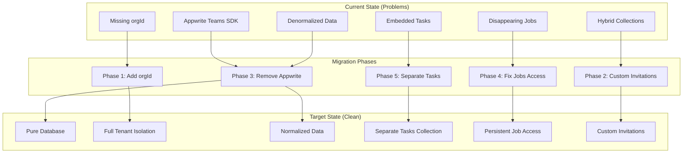
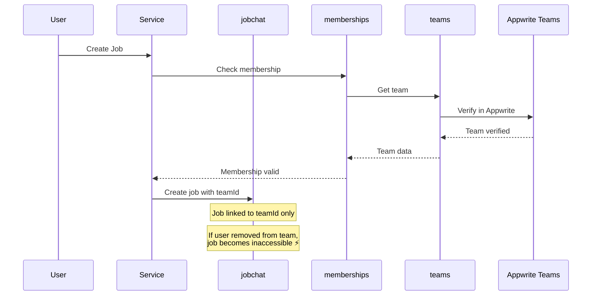
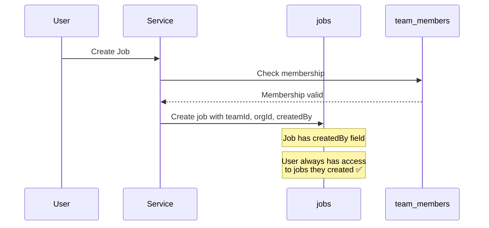

# Database Entity Relationship Diagram

## Current Architecture (With Issues)

```mermaid
erDiagram
    organizations ||--o{ teams : contains
    organizations ||--o{ subscriptions : has
    organizations ||--o{ revenuecat_events : tracks
    
    teams ||--o{ jobchat : contains
    teams ||--o{ memberships : has
    teams ||--o{ messages : contains
    
    jobchat ||--o{ messages : contains
    jobchat ||--o{ job_tag_assignments : tagged
    
    tag_templates ||--o{ job_tag_assignments : assigns
    
    memberships }o--|| users : references
    memberships }o--|| teams : belongs_to
    
    messages }o--|| users : sent_by
    messages }o--|| jobchat : belongs_to
    
    users ||--o{ user_contacts : has
    users ||--o{ contact_matches : matched
    users ||--o{ notifications : receives
    users ||--o{ user_push_tokens : has
    users ||--o{ user_preferences : has
    users ||--o{ user_contact_sync : tracks
    
    %% Missing orgId references (highlighted in red)
    memberships }o..o{ organizations : "🔴 MISSING orgId"
    notifications }o..o{ organizations : "🔴 MISSING orgId"
    tag_templates }o..o{ organizations : "🔴 MISSING orgId"
    job_tag_assignments }o..o{ organizations : "🔴 MISSING orgId"
    
    %% Disappearing jobs issue
    memberships ||--x|{ jobchat : "⚡ REMOVAL = lost access"
    
    %% Hybrid architecture dependency
    teams }o..o{ appwrite_teams : "🟡 HYBRID: appwriteTeamId"
    memberships }o..o{ appwrite_memberships : "🟡 HYBRID: sync required"

    organizations {
        string $id PK
        string orgName
        string ownerId
        string description
        string logoUrl
        boolean isActive
        string settings
        string premiumTier
        string currentProductId
        string subscriptionId
        string subscriptionExpiryDate
        string revenueCatCustomerId
        boolean hdCaptureEnabled
        boolean timestampEnabled
        boolean watermarkEnabled
        boolean videoRecordingEnabled
        boolean hdVideoEnabled
        datetime $createdAt
        datetime $updatedAt
    }
    
    teams {
        string $id PK
        string teamName
        string appwriteTeamId "🟡 DEPRECATED"
        string orgId FK
        string description
        string email
        string website
        string address
        string phone
        string teamPhotoUrl
        boolean isActive
        string settings
        datetime $createdAt
        datetime $updatedAt
    }
    
    memberships {
        string $id PK
        string userId FK
        string teamId FK
        string role
        string userEmail
        string userName
        string profilePicture
        string invitedBy
        datetime joinedAt
        boolean isActive
        boolean canShareJobReports
        datetime $createdAt
        datetime $updatedAt
        string orgId "🔴 MISSING"
    }
    
    jobchat {
        string $id PK
        string title
        string description
        boolean isPrivate
        string status
        string createdBy
        string createdByName "📊 DENORMALIZED"
        datetime deletedAt
        string teamId FK
        string orgId FK
        number $sequence
        datetime $createdAt
        datetime $updatedAt
    }
    
    messages {
        string $id PK
        string content
        string senderId FK
        string senderName "📊 DENORMALIZED"
        string senderPhoto "📊 DENORMALIZED"
        string jobId FK
        string teamId FK
        string orgId FK
        array imageUrls
        array imageFileIds
        string videoUrl
        string videoFileId
        string audioUrl
        string audioFileId
        number audioDuration
        string fileUrl
        string fileFileId
        string fileName
        number fileSize
        string fileMimeType
        object locationData
        string messageType
        boolean isTask
        string taskStatus
        boolean isDuty
        string dutyStatus
        string replyToMessageId
        number replyCount
        datetime $createdAt
        datetime $updatedAt
    }
    
    tag_templates {
        string $id PK
        string name
        string color
        string icon
        string description
        boolean isActive
        number sortOrder
        string createdBy
        datetime $createdAt
        datetime $updatedAt
        string orgId "🔴 MISSING"
    }
    
    job_tag_assignments {
        string $id PK
        string jobId FK
        string tagTemplateId FK
        string assignedBy
        datetime assignedAt
        boolean isActive
        datetime $createdAt
        datetime $updatedAt
        string orgId "🔴 MISSING"
    }
    
    notifications {
        string $id PK
        string userId FK
        string type
        string title
        string message
        string data
        boolean isRead
        datetime readAt
        datetime $createdAt
        datetime $updatedAt
        string orgId "🔴 MISSING"
        string teamId "🔴 MISSING"
    }
    
    subscriptions {
        string $id PK
        string userId FK
        string orgId FK
        string revenueCatCustomerId
        string productId
        string status
        datetime startDate
        datetime expiryDate
        boolean autoRenewing
        datetime canceledAt
        datetime lastSyncedAt
        datetime trialEndDate
        string packageId
        datetime $createdAt
        datetime $updatedAt
    }
    
    users {
        string $id PK "Appwrite Auth"
        string email
        string name
    }
    
    user_contacts {
        string $id PK
        string userId FK
        string phoneHash
        string emailHash
        string contactHash
        string contactType
        datetime syncedAt
        boolean isActive
        datetime $createdAt
        datetime $updatedAt
    }
    
    contact_matches {
        string $id PK
        string userId FK
        string matchedUserId FK
        string contactHash
        string matchType
        datetime matchedAt
        boolean isActive
        datetime $createdAt
        datetime $updatedAt
    }
    
    user_preferences {
        string $id PK
        string userId FK
        boolean timestampEnabled
        string timestampFormat
        object hdPreferences
        string hdPreferencesRaw
        object timestampPreferences
        datetime $createdAt
        datetime $updatedAt
    }
    
    user_push_tokens {
        string $id PK
        string userId FK
        string token
        string platform
        datetime createdAt
        datetime updatedAt
    }
    
    user_contact_sync {
        string $id PK
        string userId FK
        datetime lastSyncedAt
        number contactsCount
        number matchesCount
        string syncStatus
        number syncVersion
        datetime $createdAt
        datetime $updatedAt
    }
    
    revenuecat_events {
        string $id PK
        string eventId
        string eventType
        string eventCategory
        string customerId
        string userId FK
        string orgId FK
        string productId
        string eventData
        number attemptNumber
        string processedStatus
        datetime processedAt
        string errorMessage
        datetime $createdAt
        datetime $updatedAt
    }
```

---

## Target Architecture (Post Migration)

```mermaid
erDiagram
    organizations ||--o{ org_members : has
    organizations ||--o{ teams : contains
    organizations ||--o{ subscriptions : has
    
    org_members }o--|| users : is
    
    teams ||--o{ team_members : has
    teams ||--o{ jobs : contains
    
    team_members }o--|| users : is
    team_members }o--|| teams : belongs_to
    
    jobs ||--o{ messages : contains
    jobs ||--o{ tasks : has
    jobs ||--o{ media : contains
    
    messages }o--|| users : sent_by
    messages }o--|| jobs : belongs_to
    
    tasks }o--|| users : assigned_to
    tasks }o--|| jobs : belongs_to
    
    invitations }o--|| teams : invites_to
    invitations }o--|| users : sent_by
    invitations }o--|| users : received_by
    
    users ||--o{ user_contacts : has
    users ||--o{ contact_matches : matched
    
    organizations {
        string $id PK
        string orgName
        string slug
        string ownerId FK
        string description
        string logoUrl
        string billingEmail
        boolean isActive
        string settings
        string premiumTier
        string currentProductId
        string subscriptionId
        string subscriptionExpiryDate
        string revenueCatCustomerId
        boolean hdCaptureEnabled
        boolean timestampEnabled
        boolean watermarkEnabled
        boolean videoRecordingEnabled
        boolean hdVideoEnabled
        datetime $createdAt
        datetime $updatedAt
    }
    
    org_members {
        string $id PK
        string orgId FK
        string userId FK
        string role "owner|admin|member"
        datetime joinedAt
        boolean isActive
        datetime $createdAt
        datetime $updatedAt
    }
    
    teams {
        string $id PK
        string teamName
        string slug
        string orgId FK
        string createdBy FK
        string description
        string email
        string website
        string address
        string phone
        string teamPhotoUrl
        boolean isActive
        string settings
        datetime $createdAt
        datetime $updatedAt
    }
    
    team_members {
        string $id PK
        string teamId FK
        string userId FK
        string orgId FK
        string role "owner|admin|member"
        datetime joinedAt
        boolean isActive
        datetime $createdAt
        datetime $updatedAt
    }
    
    invitations {
        string $id PK
        string teamId FK
        string orgId FK
        string invitedBy FK
        string invitedEmail
        string invitedName
        string role
        string tokenHash
        string status
        datetime sentAt
        datetime expiresAt
        datetime acceptedAt
        string acceptedByUserId FK
        datetime $createdAt
        datetime $updatedAt
    }
    
    jobs {
        string $id PK
        string title
        string description
        string status
        string createdBy FK
        string assignedTo FK
        datetime dueDate
        string priority
        object location
        string teamId FK
        string orgId FK
        datetime deletedAt
        datetime $createdAt
        datetime $updatedAt
    }
    
    messages {
        string $id PK
        string content
        string senderId FK
        string jobId FK
        string teamId FK
        string orgId FK
        string messageType
        datetime editedAt
        datetime deletedAt
        string replyToMessageId FK
        number replyCount
        datetime $createdAt
        datetime $updatedAt
    }
    
    tasks {
        string $id PK
        string jobId FK
        string messageId FK
        string assignedTo FK
        string createdBy FK
        string title
        string description
        string status
        string priority
        datetime dueDate
        datetime completedAt
        string completedBy FK
        string teamId FK
        string orgId FK
        datetime $createdAt
        datetime $updatedAt
    }
    
    media {
        string $id PK
        string jobId FK
        string messageId FK
        string uploadedBy FK
        string type "image|video|audio|file"
        string fileName
        number fileSize
        string mimeType
        string url
        string thumbnailUrl
        object metadata
        string teamId FK
        string orgId FK
        datetime $createdAt
        datetime $updatedAt
    }
    
    subscriptions {
        string $id PK
        string userId FK
        string orgId FK
        string revenueCatCustomerId
        string productId
        string status
        datetime startDate
        datetime expiryDate
        boolean autoRenewing
        datetime canceledAt
        datetime lastSyncedAt
        datetime trialEndDate
        string packageId
        datetime $createdAt
        datetime $updatedAt
    }
    
    users {
        string $id PK
        string email
        string name
        string profilePicture
        object preferences
        array pushTokens
    }
    
    user_contacts {
        string $id PK
        string userId FK
        string phoneHash
        string emailHash
        string contactHash
        string contactType
        datetime syncedAt
        boolean isActive
        datetime $createdAt
        datetime $updatedAt
    }
    
    contact_matches {
        string $id PK
        string userId FK
        string matchedUserId FK
        string contactHash
        string matchType
        datetime matchedAt
        boolean isActive
        datetime $createdAt
        datetime $updatedAt
    }
```

---

## Key Changes from Current to Target

### 1. **New Collections**

| Collection | Purpose |
|------------|---------|
| `org_members` | Organization-level membership (separate from teams) |
| `invitations` | Custom invitation system (replaces Appwrite Teams) |
| `tasks` | Separate from messages (no more embedded tasks) |
| `media` | Centralized media storage (replaces embedded URLs) |

### 2. **Removed Collections**

| Collection | Reason |
|------------|--------|
| `tag_templates` | Moved to org-scoped with `orgId` added |
| `job_tag_assignments` | Simplified tagging system |
| `jobchat` | Renamed to `jobs` for clarity |
| `user_preferences` | Merged into `users` table |
| `user_push_tokens` | Merged into `users` table |
| `notifications` | Will be rebuilt with org context |

### 3. **Critical Field Additions**

#### ✅ Added orgId Everywhere
```typescript
// All collections now have:
orgId: string;  // Required for tenant isolation
```

#### ✅ Removed Denormalized Fields
```typescript
// Removed (fetch from users/memberships at query time):
jobchat.createdByName
messages.senderName
messages.senderPhoto
memberships.userName
memberships.profilePicture
```

#### ✅ Added Job Assignment
```typescript
jobs: {
  assignedTo?: string;     // User ID
  dueDate?: string;        // ISO date
  priority: 'low' | 'medium' | 'high';
  location?: { lat: number; lng: number; address?: string };
}
```

### 4. **Fixed Disappearing Jobs Issue**

**Current Problem:**
```typescript
// User removed from team → loses access to jobs
listJobChats(teamId, orgId)  // Filters by membership
```

**Target Solution:**
```typescript
// User can access jobs they created OR are assigned to
listJobs(userId, orgId) {
  return Query.or([
    Query.equal('createdBy', userId),
    Query.equal('assignedTo', userId)
  ]);
}
```

### 5. **Removed Hybrid Dependencies**

**Current:**
```typescript
teams.appwriteTeamId        // Links to Appwrite Teams
memberships.syncsWithAppwrite  // Complex sync logic
```

**Target:**
```typescript
// Pure database - no external dependencies
teams.createdBy             // Simple ownership
memberships.userId          // Direct reference
```

---

## Visual Legend

| Symbol | Meaning |
|--------|---------|
| 🔴 | Missing critical field (orgId) |
| ⚡ | Disappearing jobs issue pathway |
| 🟡 | Circular dependency or hybrid architecture |
| ✅ | Proper relationship |
| 📊 | Denormalized data (can become stale) |
| `FK` | Foreign Key |
| `PK` | Primary Key |
| `\|\|` | One |
| `o{` | Many |
| `--` | Solid line: Required relationship |
| `..` | Dotted line: Optional/problematic relationship |

---

## Migration Path Visualization



---

## Data Flow Examples

### Current: Creating a Job (Problematic)


### Target: Creating a Job (Fixed)


---

## Index Strategy

### Critical Indexes for Target Architecture

```sql
-- organizations
CREATE INDEX idx_org_owner ON organizations(ownerId);
CREATE INDEX idx_org_slug ON organizations(slug);

-- org_members (NEW)
CREATE UNIQUE INDEX idx_org_member ON org_members(orgId, userId);
CREATE INDEX idx_org_member_user ON org_members(userId);

-- teams
CREATE INDEX idx_team_org ON teams(orgId);
CREATE INDEX idx_team_slug ON teams(slug);

-- team_members
CREATE UNIQUE INDEX idx_team_member ON team_members(teamId, userId);
CREATE INDEX idx_team_member_user ON team_members(userId);
CREATE INDEX idx_team_member_org ON team_members(orgId);

-- invitations
CREATE UNIQUE INDEX idx_invite_token ON invitations(tokenHash);
CREATE INDEX idx_invite_team ON invitations(teamId, status);
CREATE INDEX idx_invite_email ON invitations(invitedEmail, status);

-- jobs
CREATE INDEX idx_job_team ON jobs(teamId);
CREATE INDEX idx_job_org ON jobs(orgId);
CREATE INDEX idx_job_creator ON jobs(createdBy);
CREATE INDEX idx_job_assigned ON jobs(assignedTo);
CREATE INDEX idx_job_status ON jobs(status);
CREATE INDEX idx_job_due ON jobs(dueDate);

-- messages
CREATE INDEX idx_message_job ON messages(jobId);
CREATE INDEX idx_message_sender ON messages(senderId);
CREATE INDEX idx_message_org ON messages(orgId);

-- tasks (NEW)
CREATE INDEX idx_task_job ON tasks(jobId);
CREATE INDEX idx_task_assigned ON tasks(assignedTo);
CREATE INDEX idx_task_org ON tasks(orgId);
```

---

## Validation Queries

### Verify No Orphaned Records

```typescript
// Check for jobs without valid teams
const orphanedJobs = await databases.listDocuments('jobs', [
  Query.notEqual('teamId', [/* list of valid team IDs */])
]);

// Check for memberships without orgId (post-migration)
const missingOrgId = await databases.listDocuments('team_members', [
  Query.isNull('orgId')
]);

// Verify org isolation
const crossOrgAccess = await databases.listDocuments('jobs', [
  Query.equal('orgId', 'org-a'),
  Query.equal('teamId', 'team-from-org-b')  // Should return 0 results
]);
```

---

## Conclusion

This ERD shows the transformation from a **hybrid, inconsistent architecture** to a **clean, fully multi-tenant system**. The key improvements are:

1. ✅ **Tenant Isolation**: orgId on every collection
2. ✅ **Data Integrity**: No denormalized fields
3. ✅ **Job Persistence**: Created jobs don't disappear
4. ✅ **Clean Architecture**: No Appwrite Teams dependency
5. ✅ **Proper Relationships**: Clear ownership and membership chains

**Next Steps:**
1. Review this ERD with the team
2. Update `MIGRATION_CHECKLIST.md` with specific tasks
3. Implement `services/teamService.ts` abstraction layer
4. Begin Phase 1: Add orgId to critical collections
